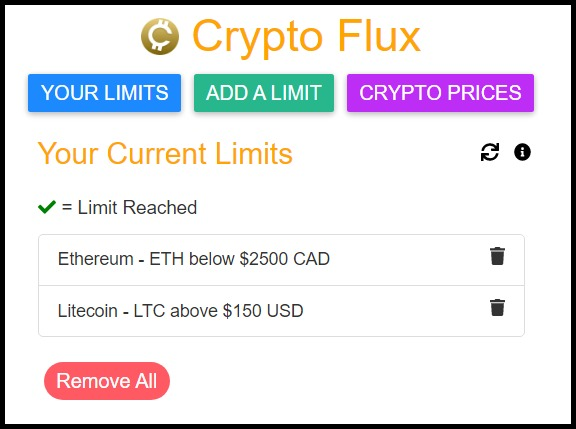
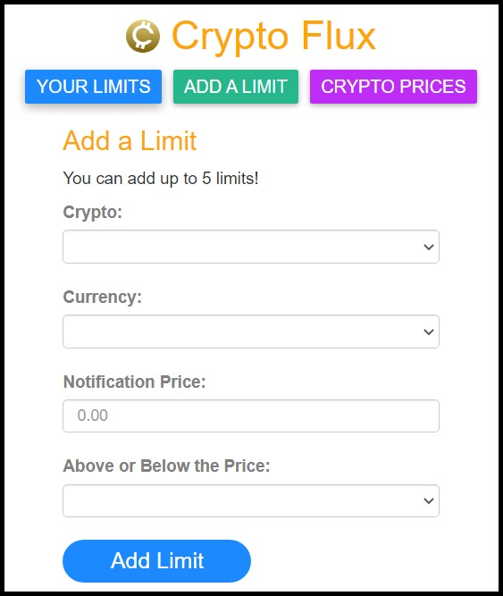

# Crypto Flux

## Description
This is a chrome extension that allows you to track prices of various cryptocurrencies. You can set limits (e.g. a limit for Bitcoin above 35k USD) and if the limit is met, a notification will be sent to the user.

## Some Specifications
* A maximum of 5 limits can be set
* The data is updated every 30 seconds

## Functionality
### There are 3 main tabs.

One for checking on your current limits:

One for adding a limit:

And one for looking up current crypto prices:

*This extension is currently not available on the Chrome Web Store, but will be available shortly.*