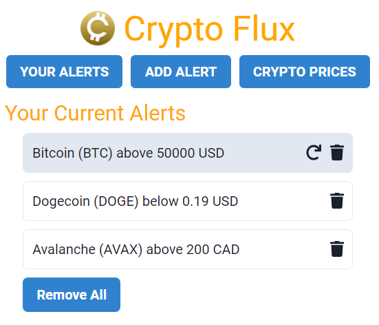
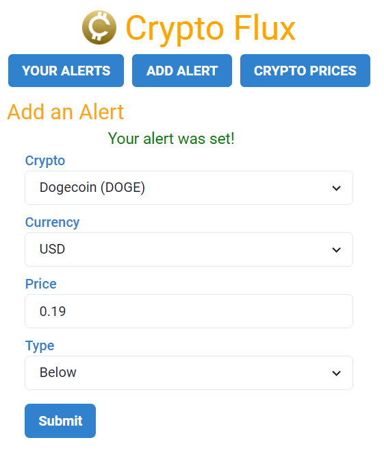
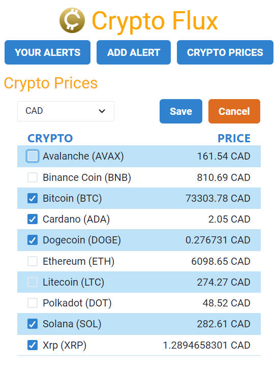

# Crypto Flux

## Description
This is a chrome extension that allows you to track prices of multiple cryptocurrencies, in multiple fiat currencies. You can set alerts (e.g. an alert for Bitcoin above 100k CAD) and if the alert is met, a notification will be sent to the user. The extension is available [here](https://chrome.google.com/webstore/detail/crypto-flux/lfihplojaiglbfjdkelpjmkdkfeomgef?hl=en) on the Chrome Web Store.

## Some Specifications
* 10 cryptocurrencies are currently available, with more possibly coming later
* 10 different fiat currencies are available, with more possibly coming later
* A maximum of 10 alerts can be set
* The app refreshes its data roughly every 10 seconds
* Desktop Notifications for Google Chrome have to be enabled for alerts to work

## Features
### There are 3 main interfaces.

* One for checking on your current alerts
* One for adding alerts
* And one for looking up current crypto prices

## Running Locally
Clone this repo and enter the new `crypto-flux` directory. Then run:
```
npm run start
```

A `dist` directory will be created in the crypto-flux directory.

Then:
1. Head to chrome://extensions/ on your Chrome web browser.
2. Toggle "Developer Mode" on the top right.
3. Click "Load Unpacked" on the top left.
4. Select the mentioned "dist" folder.
5. Pin the extension.


## Screenshots
Check your Alerts          |  Set Alerts               |  Track specific coin prices
:-------------------------:|:-------------------------:|:-------------------------:
  |  | 

## Credits
This extension was built on top of a boilerplate React Chrome Extention, available at https://github.com/extend-chrome/ts-react-boilerplate.git.


